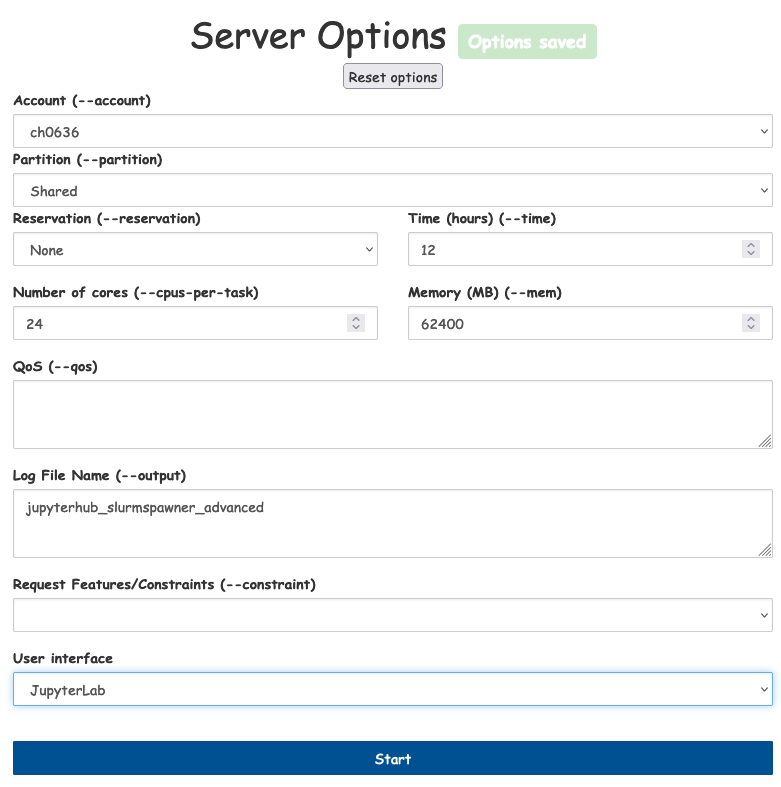

# Notebooks for prototyping

[](https://nbviewer.jupyter.org/github/larsbuntemeyer/notebooks/tree/main/)


These notebooks contain some prototype code for working with large CMIP or CORDEX datasets. Most notebooks are not documented 
very well but are used only to try out some coding concepts. Most notebooks require data access to the 
[DKRZ data pool](https://www.dkrz.de/up/de-services/de-data-management/de-cmip-data-pool) using their intake catalogs. However, in principle
you should also be able to run CMIP6 notebooks if you switch to the [PANGEO datastore url](https://github.com/pangeo-data/pangeo-datastore).

* [`CMIP6-global-warming.ipynb`](https://nbviewer.jupyter.org/github/larsbuntemeyer/notebooks/blob/main/CMIP6-global-warming.ipynb?flush_cache=true): data access, processing and plotting of CMIP6 data at DKRZ using `intake-esm` with `xarray` and `dask`.
* [`CMIP6-access-dkrz.ipynb`](https://nbviewer.jupyter.org/github/larsbuntemeyer/notebooks/blob/main/CMIP6-access-dkrz.ipynb?flush_cache=true): data access and processing of CMIP6 data at DKRZ using `intake-esm` with `xarray` and `dask`.
* [`esgf.ipynb`](https://nbviewer.jupyter.org/github/larsbuntemeyer/notebooks/blob/main/esgf.ipynb?flush_cache=true): access of cordex and cmip data from the ESGF via opendap protocol.
* [`xclim-test.ipynb`](https://nbviewer.jupyter.org/github/larsbuntemeyer/notebooks/blob/main/xclim-test.ipynb?flush_cache=true): compute CMIP6 climate indicators using [xclim](https://github.com/Ouranosinc/xclim) and dask.


## Requirements

The most important packages that will make your work with heavy cmip datasets in ipython easier are:

  - python=3
  - ipykernel
  - tqdm
  - pandas
  - matplotlib
  - xarray
  - dask
  - intake-esm
  - seaborn
  - fsspec
  - dask-jobqueue
  - ipywidgets
  - jupyter
  - cartopy

You can use the `environment.yaml` file to easily install all dependencies, e.g.
```
conda env create -f environment.yaml
```
This should create a basic kernel called `notebooks` that you can use to run most of the notebooks in this repo. 
However, sometimes you might need to install additional packages if they are missing. 
[Here](https://jupyterhub.gitlab-pages.dkrz.de/jupyterhub-docs/kernels.html#use-your-own-kernel) is a documentation of how to install the kernel
in the [DKRZ Jupyterhub](https://jupyterhub.dkrz.de).

## Server settings - DKRZ

Here are my recommended server settings for the [JupyterLab at DKRZ](https://jupyterhub.dkrz.de).



Note, that on the `shared` partition at DKRZ, you don't have internet access (actually, you only have internet access on the `prepost` partition).
However, some packages might need internet access to cache data (e.g., regionmask `regionmask.defined_regions`, or `xarray.tutorial`). You can trigger
those downloads on the login node. Once, the data is cached in you `HOME` directory, you can use it also on the `shared` partition. Also `py-cordex` needs
some tables with domain definitions to download. You can trigger that e.g., using

```python
import cordex as cx
cx.domains.table
```
